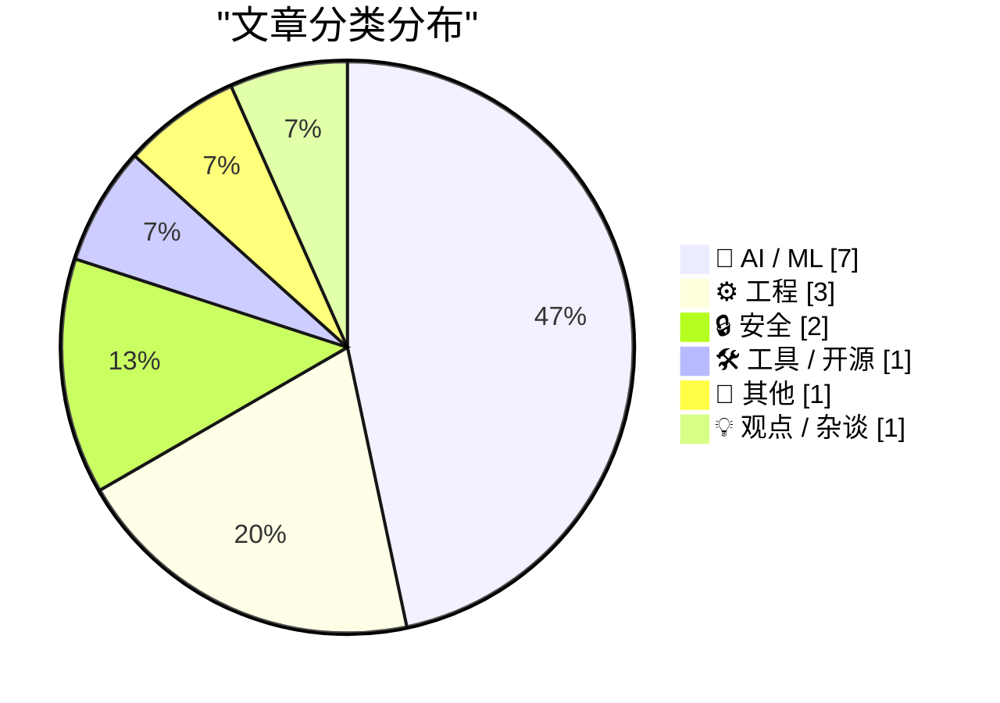
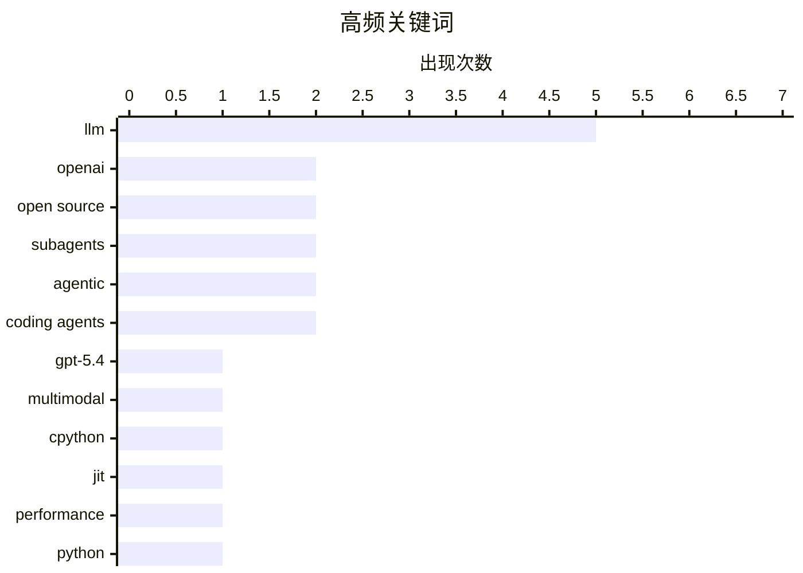

# 📰 AI 博客每日精选 — 2026-03-18

> 来自 Karpathy 推荐的 92 个顶级技术博客，AI 精选 Top 15

## 📝 今日看点

今日技术圈聚焦三大趋势：AI模型持续向高效能演进，OpenAI发布GPT-5.4 mini/nano以52美元处理76000张照片，Mistral推出119B参数的Small 4混合专家模型；编程代理成为突破LLM上下文限制的关键路径，OpenAI Codex子Agent正式可用，子Agent模式正在重塑开发者工作流；工程层面，CPython JIT编译器提前达成性能目标，macOS AArch64平台提速达11-12%。

---

## 🏆 今日必读

🥇 **GPT-5.4 mini 和 nano 发布：52 美元可描述 76000 张照片**

[GPT-5.4 mini and GPT-5.4 nano, which can describe 76,000 photos for $52](https://simonwillison.net/2026/Mar/17/mini-and-nano/#atom-everything) — simonwillison.net · 8 小时前 · 🤖 AI / ML

> OpenAI 正式发布 GPT-5.4 mini 和 nano 两款新模型，补充了两周前发布的 GPT-5.4。根据 OpenAI 自报基准测试，5.4-nano 在最大推理强度下优于上一代 GPT-5 mini。新款 mini 模型推理速度是上一代 mini 的两倍。定价方面，输入费用为 0.6 美元/百万 tokens，输出费用为 2.4 美元/百万 tokens。整体来看，这两款模型延续了 OpenAI 小型化、经济化的产品策略，为需要高效低价推理能力的开发者提供了新选择。

💡 **为什么值得读**: 适用于关注 AI 模型成本和性能的开发者、产品经理。文章提供了具体的定价数据和性能对比，帮助读者评估是否迁移到新版本。

🏷️ GPT-5.4, OpenAI, LLM, multimodal

🥈 **CPython JIT 编译器提前达成性能目标**

[Quoting Ken Jin](https://simonwillison.net/2026/Mar/17/ken-jin/#atom-everything) — simonwillison.net · 6 小时前 · ⚙️ 工程

> CPython JIT 编译器在 macOS AArch64 和 Linux x86_64 两个平台上提前达成性能目标。macOS AArch64 平台的 JIT 性能比尾调用解释器快 11-12%，Linux x86_64 平台比标准解释器快 5-6%。该 JIT 编译器作为 Python 3.15 alpha 版本的一部分，相比传统的解释器模式实现了显著的性能提升。

💡 **为什么值得读**: 适合 Python 开发者、性能工程师以及关注 Python 语言演进的技术人员。CPython JIT 的进展意味着 Python 程序的执行效率将在未来版本中获得实质改善。

🏷️ CPython, JIT, performance, Python

🥉 **Mistral Small 4：统一推理、多模态和编码能力的 119B 参数模型**

[Introducing Mistral Small 4](https://simonwillison.net/2026/Mar/16/mistral-small-4/#atom-everything) — simonwillison.net · 1 天前 · 🤖 AI / ML

> Mistral 发布 Small 4，这是一款采用 Apache 2 许可的 119B 参数混合专家模型（MoE），其中 6B 参数处于激活状态。Small 4 是 Mistral 首次将旗舰模型能力统一于单一模型的尝试，整合了用于推理的 Magistral、用于多模态的 Pixtral 以及用于代理编码的 Devstral。

💡 **为什么值得读**: 适合关注开源大模型发展的 AI 研究者和开发者。Mistral Small 4 的发布表明 MoE 架构在统一多种能力方面取得了进展，且 Apache 2 许可使其具有较高的商业可用性。

🏷️ Mistral Small 4, MoE, open source, LLM

---

## 📊 数据概览

| 扫描源 | 抓取文章 | 时间范围 | 精选 |
|:---:|:---:|:---:|:---:|
| 89/92 | 2524 篇 → 41 篇 | 48h | **15 篇** |

### 分类分布



### 高频关键词



<details>
<summary>📈 纯文本关键词图（终端友好）</summary>

```
llm           │ ████████████████████ 5
openai        │ ████████░░░░░░░░░░░░ 2
open source   │ ████████░░░░░░░░░░░░ 2
subagents     │ ████████░░░░░░░░░░░░ 2
agentic       │ ████████░░░░░░░░░░░░ 2
coding agents │ ████████░░░░░░░░░░░░ 2
gpt-5.4       │ ████░░░░░░░░░░░░░░░░ 1
multimodal    │ ████░░░░░░░░░░░░░░░░ 1
cpython       │ ████░░░░░░░░░░░░░░░░ 1
jit           │ ████░░░░░░░░░░░░░░░░ 1
```

</details>

### 🏷️ 话题标签

**llm**(5) · **openai**(2) · **open source**(2) · subagents(2) · agentic(2) · coding agents(2) · gpt-5.4(1) · multimodal(1) · cpython(1) · jit(1) · performance(1) · python(1) · mistral small 4(1) · moe(1) · codex(1) · coding agent(1) · context window(1) · engineering(1) · apple exclaves(1) · camera indicator(1)

---

## 🤖 AI / ML

### 1. GPT-5.4 mini 和 nano 发布：52 美元可描述 76000 张照片

[GPT-5.4 mini and GPT-5.4 nano, which can describe 76,000 photos for $52](https://simonwillison.net/2026/Mar/17/mini-and-nano/#atom-everything) — **simonwillison.net** · 8 小时前 · ⭐ 26/30

> OpenAI 正式发布 GPT-5.4 mini 和 nano 两款新模型，补充了两周前发布的 GPT-5.4。根据 OpenAI 自报基准测试，5.4-nano 在最大推理强度下优于上一代 GPT-5 mini。新款 mini 模型推理速度是上一代 mini 的两倍。定价方面，输入费用为 0.6 美元/百万 tokens，输出费用为 2.4 美元/百万 tokens。整体来看，这两款模型延续了 OpenAI 小型化、经济化的产品策略，为需要高效低价推理能力的开发者提供了新选择。

🏷️ GPT-5.4, OpenAI, LLM, multimodal

---

### 2. Mistral Small 4：统一推理、多模态和编码能力的 119B 参数模型

[Introducing Mistral Small 4](https://simonwillison.net/2026/Mar/16/mistral-small-4/#atom-everything) — **simonwillison.net** · 1 天前 · ⭐ 24/30

> Mistral 发布 Small 4，这是一款采用 Apache 2 许可的 119B 参数混合专家模型（MoE），其中 6B 参数处于激活状态。Small 4 是 Mistral 首次将旗舰模型能力统一于单一模型的尝试，整合了用于推理的 Magistral、用于多模态的 Pixtral 以及用于代理编码的 Devstral。

🏷️ Mistral Small 4, MoE, open source, LLM

---

### 3. 子代理模式：突破 LLM 上下文限制

[Subagents](https://simonwillison.net/guides/agentic-engineering-patterns/subagents/#atom-everything) — **simonwillison.net** · 15 小时前 · ⭐ 23/30

> LLM 受限于上下文窗口大小，即工作内存中能容纳的 token 数量。过去两年这一数值增长停滞，普遍上限约 100 万 tokens。子代理（Subagents）作为智能体工程的一种模式，通过将任务分解给多个子代理来绕过单一 LLM 的上下文限制，实现更复杂的任务处理能力。

🏷️ subagents, LLM, agentic, context window

---

### 4. 编程代理工作原理解析

[How coding agents work](https://simonwillison.net/guides/agentic-engineering-patterns/how-coding-agents-work/#atom-everything) — **simonwillison.net** · 1 天前 · ⭐ 23/30

> 编程代理是一种软件框架，作为 LLM 的「马具」（harness），为语言模型扩展额外能力。它通常包含工具调用、持久化内存、状态管理和人机协作接口等核心组件，使 LLM 能够执行代码编写、调试、测试等完整的软件开发流程。

🏷️ coding agents, agentic, LLM, engineering

---

### 5. Anthropic 对齐团队的黑客攻击模拟：让政策制定者感知 AI 失控风险

[Quoting A member of Anthropic’s alignment-science team](https://simonwillison.net/2026/Mar/16/blackmail/#atom-everything) — **simonwillison.net** · 1 天前 · ⭐ 22/30

> Anthropic 对齐科学团队设计了一个「勒索信练习」（blackmail exercise），旨在让政策制定者直观感受到 AI 对齐失败的风险。该练习通过模拟具体场景，让从未考虑过 AI 失控风险的人能够切身体会到 AI 误对齐的潜在危害。

🏷️ AI safety, Anthropic, alignment, red teaming

---

### 6. 数据新闻从业者的编程代理工作坊指南

[Coding agents for data analysis](https://simonwillison.net/2026/Mar/16/coding-agents-for-data-analysis/#atom-everything) — **simonwillison.net** · 1 天前 · ⭐ 22/30

> Simon Willison 为 NICAR 2026 制作了三小时的工作坊材料，主题为「用于数据分析的编程代理」。工作坊演示了如何使用 Claude Code 和 OpenAI Codex 等工具进行数据探索、清洗和分析，涵盖代码编写、Shell 命令、文件操作等实用技能。

🏷️ coding agents, data analysis, journalism, NICAR

---

### 7. 癌症检测：AI的真正考验

[F Cancer](https://garymarcus.substack.com/p/f-cancer) — **garymarcus.substack.com** · 1 天前 · ⭐ 21/30

> Gary Marcus在本文中探讨了AI在癌症检测领域的实际应用与挑战。AI技术在医学影像分析领域展现出巨大潜力，但在实际临床应用中仍面临诸多困难。文章分析了当前AI系统在癌症筛查中的表现，指出实验室测试结果与真实世界应用之间存在显著差距。Marcus强调，真正的AI考验不在于基准测试成绩，而在于能否在复杂的临床环境中可靠工作。文章讨论了数据质量、算法偏见、可解释性等关键问题，并呼吁建立更严格的AI医疗设备评估标准。

🏷️ AI, cancer, medical

---

## ⚙️ 工程

### 8. CPython JIT 编译器提前达成性能目标

[Quoting Ken Jin](https://simonwillison.net/2026/Mar/17/ken-jin/#atom-everything) — **simonwillison.net** · 6 小时前 · ⭐ 24/30

> CPython JIT 编译器在 macOS AArch64 和 Linux x86_64 两个平台上提前达成性能目标。macOS AArch64 平台的 JIT 性能比尾调用解释器快 11-12%，Linux x86_64 平台比标准解释器快 5-6%。该 JIT 编译器作为 Python 3.15 alpha 版本的一部分，相比传统的解释器模式实现了显著的性能提升。

🏷️ CPython, JIT, performance, Python

---

### 9. Django 贡献者谈 LLM 使用：理解代码是核心

[Quoting Tim Schilling](https://simonwillison.net/2026/Mar/17/tim-schilling/#atom-everything) — **simonwillison.net** · 11 小时前 · ⭐ 21/30

> Tim Schilling 指出，如果贡献者不理解 ticket、不理解解决方案，或者不理解 PR 反馈，那么使用 LLM 辅助贡献会损害整个 Django 项目。对审查者来说，与一个看似人类却缺乏真实理解的「面具」交流会令人沮丧。开源贡献尤其是 Django 是一项集体事业，抹去人性会影响社区协作。

🏷️ Django, LLM, open source, contribution

---

### 10. Windows栈限制检查回顾：PowerPC架构篇

[Windows stack limit checking retrospective: PowerPC](https://devblogs.microsoft.com/oldnewthing/20260316-00/?p=112140) — **devblogs.microsoft.com/oldnewthing** · 1 天前 · ⭐ 21/30

> 本文是Windows栈限制检查机制的技术回顾系列文章之一，聚焦于PowerPC架构下的实现细节。作者通过逆向分析的方式，从数学角度重新推导了PowerPC平台上Windows栈检查的实现逻辑。栈限制检查是操作系统内存安全的重要组成部分，文章深入探讨了当时微软工程师在特定硬件架构上的设计考量。作为《The Old New Thing》博客的技术考古系列，本文展示了Windows操作系统底层机制的演进历程。

🏷️ Windows, PowerPC, stack

---

## 🔒 安全

### 11. Apple Exclaves 与 MacBook Neo 屏幕摄像头指示灯的安全设计

[★ Apple Exclaves and the Secure Design of the MacBook Neo’s On-Screen Camera Indicator](https://daringfireball.net/2026/03/apple_enclaves_neo_camera_indicator) — **daringfireball.net** · 1 天前 · ⭐ 23/30

> Apple 在 MacBook Neo 中引入了 Exclaves 安全架构，实现了屏幕摄像头指示灯设计。这意味着即使存在内核级别的安全漏洞，也无法在摄像头开启时不让指示灯出现在屏幕上。这一设计从硬件和软件层面共同保障了用户隐私安全。

🏷️ Apple Exclaves, camera indicator, security design, MacBook Neo

---

### 12. 每周更新495：Have I Been Pwned的技术演进之路

[Weekly Update 495](https://www.troyhunt.com/weekly-update-495/) — **troyhunt.com** · 1 天前 · ⭐ 21/30

> Troy Hunt撰写本周更新，回顾了Have I Been Pwned（HIBP）网站从创立至今的技术架构演变。最初网站仅由一个简单网站、数据库和1.5亿+个邮箱地址组成。随着时间推移，系统逐渐引入Serverless Functions、Edge Computing（边缘计算）以及新型数据存储架构。即便是查询一个简单的邮箱地址，其底层技术实现也已经发生了根本性变化。文章详细描述了技术选型背后的考量，包括性能扩展、成本控制和全球可用性等方面的挑战。Troy Hunt分享了如何在保持服务稳定性的同时逐步现代化技术栈的实践经验。

🏷️ security, data breach, Have I Been Pwned, web development

---

## 🛠 工具 / 开源

### 13. OpenAI Codex 子代理和自定义代理正式可用

[Use subagents and custom agents in Codex](https://simonwillison.net/2026/Mar/16/codex-subagents/#atom-everything) — **simonwillison.net** · 1 天前 · ⭐ 24/30

> OpenAI Codex 的子代理功能经过数周预览后正式发布。子代理与 Claude Code 实现非常相似，提供 "explorer"、"worker" 和 "default" 三种默认类型。"worker" 和 "default" 的区别尚未完全明确，但根据 CSV 示例来看，"worker" 可能更侧重于执行具体任务。

🏷️ Codex, subagents, OpenAI, coding agent

---

## 📝 其他

### 14. Apple 发布 AirPods Max 2，搭载 H2 芯片带来革新音频体验

[Apple Introduces AirPods Max 2](https://www.apple.com/newsroom/2026/03/apple-introduces-airpods-max-2-powered-by-h2/) — **daringfireball.net** · 1 天前 · ⭐ 21/30

> Apple正式发布AirPods Max 2，这是其旗舰头戴式耳机的第二代产品。新品搭载H2芯片，实现了更出色的主动降噪（ANC）功能，同时提升了音质表现。AirPods Max 2首次引入多项智能音频功能，包括Adaptive Audio（自适应音频）、Conversation Awareness（对话感知）、Voice Isolation（语音隔离）和Live Translation（实时翻译）。这些功能此前仅在AirPods Pro上可用，此次是首次登陆Max系列。针对内容创作者群体，新款AirPods Max解锁了播客、音乐人和视频创作者的创意可能性，提供录音室级别的音频录制能力。AirPods Max 2延续了标志性的包耳式设计语言，在保持经典外观的同时实现了技术迭代。

🏷️ AirPods Max 2, Apple, ANC, H2 chip

---

## 💡 观点 / 杂谈

### 15. 最后一款安静之物

[‘The Last Quiet Thing’](https://www.terrygodier.com/the-last-quiet-thing) — **daringfireball.net** · 1 天前 · ⭐ 19/30

> Terry Godier在本文中探讨了产品设计与用户注意力的关系，阐述了他对现代设计中「安静」理念的思考。文章以Casio手表为切入点，分析了这款产品如何在功能性与简洁性之间取得平衡——不仅显示准确时间，还保留了实用的物理按钮设计。Godier认为，在当今充满干扰的数字环境中，真正优秀的设计应该尊重用户的注意力，不刻意争夺用户的关注。他将这种设计哲学称为「最后一款安静之物」，强调产品应当作为工具服务于人，而非通过过度设计来吸引注意。文章探讨了功能完整性、审美克制与用户体验之间的深层联系。

🏷️ design, attention, philosophy, Casio

---

*生成于 2026-03-18 04:05 | 扫描 89 源 → 获取 2524 篇 → 精选 15 篇*
*基于 [Hacker News Popularity Contest 2025](https://refactoringenglish.com/tools/hn-popularity/) RSS 源列表，由 [Andrej Karpathy](https://x.com/karpathy) 推荐*
*由「懂点儿AI」制作，欢迎关注同名微信公众号获取更多 AI 实用技巧 💡*
