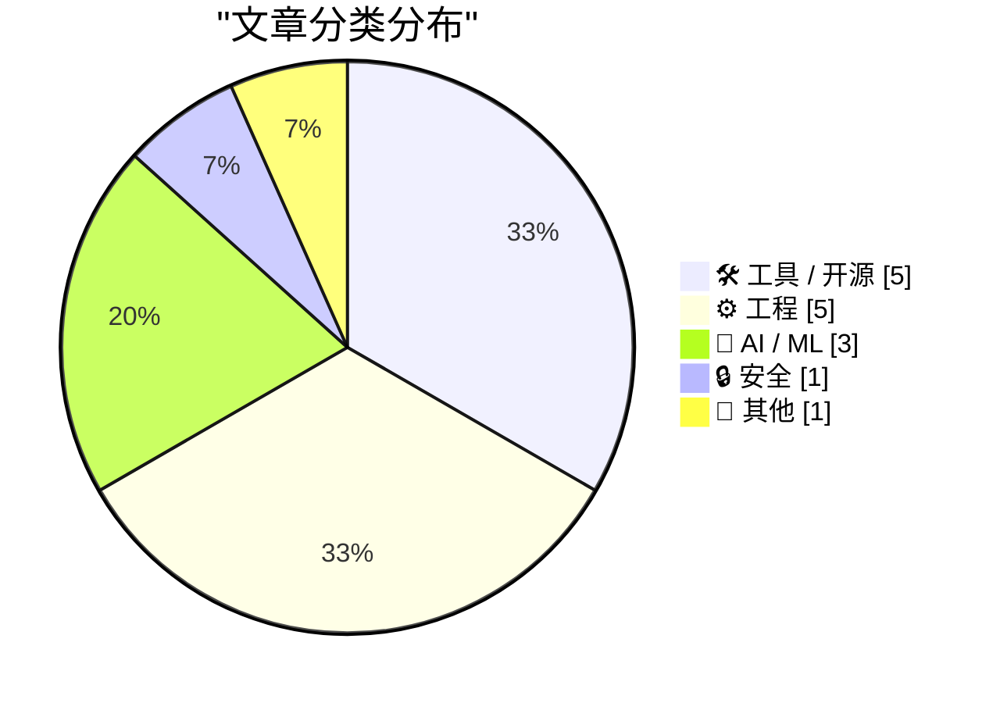
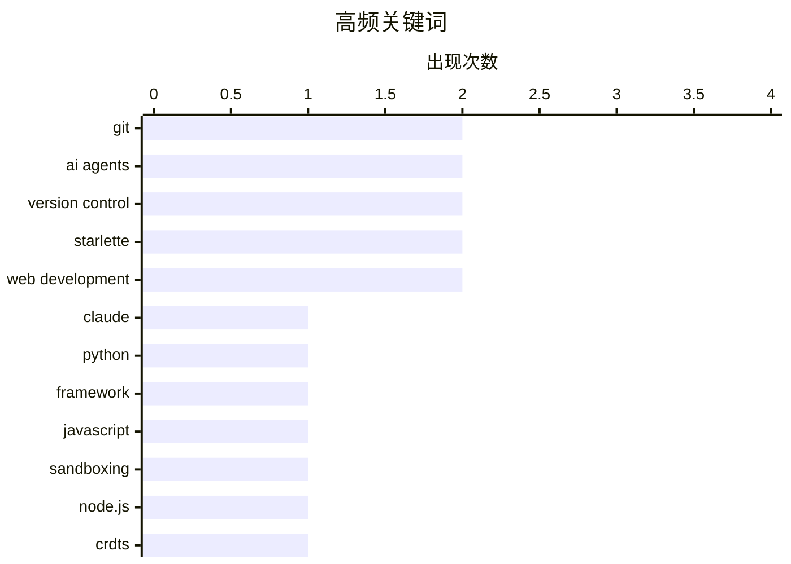

# 📰 AI 博客每日精选 — 2026-03-23

> 来自 Karpathy 推荐的 92 个顶级技术博客，AI 精选 Top 15

## 📝 今日看点

今日技术圈聚焦三大趋势：AI编程代理与开发工具深度融合，Git已成为代理协作的核心基础设施，同时Starlette 1.0发布标志着FastAPI生态的重要里程碑；去中心化协作技术CRDTs获得关注，Bram Cohen发布相关开源实现；Web性能优化问题再次引发讨论，PC Gamer网站出现37MB页面体积的极端案例，凸显前端工程的质量隐患。

---

## 🏆 今日必读

🥇 **在编程代理中使用 Git**

[Using Git with coding agents](https://simonwillison.net/guides/agentic-engineering-patterns/using-git-with-coding-agents/#atom-everything) — simonwillison.net · 1 天前 · 🤖 AI / ML

> Git 是与编程代理协作的关键工具。将代码纳入版本控制可以记录代码随时间的演变，便于调查和回滚错误。所有主流编程代理都能熟练使用 Git 的基础和高级功能。这种熟练度意味着我们可以更雄心勃勃地使用 Git：不必记住所有复杂命令，可以依靠代理来处理；利用分支进行实验性开发；通过提交历史进行调试和回溯分析；使用 stash 暂存未完成的改动；通过 rebase 保持提交历史整洁。代理的存在使得 Git 工作流变得更加高效和可靠。

💡 **为什么值得读**: 适合使用 AI 编程代理的开发者，以及希望优化版本控制工作流的团队。文章提供了将 Git 与 AI 代理结合使用的实用模式和思路。

🏷️ Git, AI agents, version control

🥈 **用 Claude skills 实验 Starlette 1.0**

[Experimenting with Starlette 1.0 with Claude skills](https://simonwillison.net/2026/Mar/22/starlette/#atom-everything) — simonwillison.net · 4 小时前 · 🤖 AI / ML

> Starlette 1.0 正式发布，这是一个重要的里程碑。Starlette 可能是相对于其品牌知名度而言使用最广的 Python 框架，因为它 是 FastAPI 的基础，而 FastAPI 的热度似乎盖过了 Starlette 本身。Kim Christie 于 2018 年开始开发 Starlette，并迅速成为 Python ASGI 领域的重要框架。文章作者通过为 Claude Code 创建专门的 Starlette 1.0 skill 来实验这个新版本，探索其新特性和改进。

💡 **为什么值得读**: 适合使用 FastAPI 或 Starlette 的 Python 开发者，以及对 Web 框架新版本感兴趣的技术人员。Starlette 1.0 的发布对 Python 异步 Web 开发具有重要意义。

🏷️ Starlette, Claude, AI agents

🥉 **Starlette 1.0 skill**

[Starlette 1.0 skill](https://simonwillison.net/2026/Mar/23/starlette-1-skill/#atom-everything) — simonwillison.net · 4 小时前 · 🛠 工具 / 开源

> 这是一个关于 Starlette 1.0 的研究项目，作者创建了一个专门的 Claude skill 来帮助实验 Starlette 1.0。该 skill 提供了与 Starlette 1.0 相关的查询能力和上下文信息，方便开发者探索新版本的功能和改进。

💡 **为什么值得读**: 适合使用 Claude Code 并对 Starlette 1.0 感兴趣的开发者。这个 skill 可以作为实验 Starlette 新版本的起点。

🏷️ Starlette, Python, framework

---

## 📊 数据概览

| 扫描源 | 抓取文章 | 时间范围 | 精选 |
|:---:|:---:|:---:|:---:|
| 89/92 | 2526 篇 → 23 篇 | 48h | **15 篇** |

### 分类分布



### 高频关键词



<details>
<summary>📈 纯文本关键词图（终端友好）</summary>

```
git             │ ████████████████████ 2
ai agents       │ ████████████████████ 2
version control │ ████████████████████ 2
starlette       │ ████████████████████ 2
web development │ ████████████████████ 2
claude          │ ██████████░░░░░░░░░░ 1
python          │ ██████████░░░░░░░░░░ 1
framework       │ ██████████░░░░░░░░░░ 1
javascript      │ ██████████░░░░░░░░░░ 1
sandboxing      │ ██████████░░░░░░░░░░ 1
```

</details>

### 🏷️ 话题标签

**git**(2) · **ai agents**(2) · **version control**(2) · starlette(2) · web development(2) · claude(1) · python(1) · framework(1) · javascript(1) · sandboxing(1) · node.js(1) · crdts(1) · amazon(1) · smartphone(1) · hardware(1) · blog(1) · content aggregation(1) · features(1) · performance(1) · optimization(1)

---

## 🛠 工具 / 开源

### 1. Starlette 1.0 skill

[Starlette 1.0 skill](https://simonwillison.net/2026/Mar/23/starlette-1-skill/#atom-everything) — **simonwillison.net** · 4 小时前 · ⭐ 22/30

> 这是一个关于 Starlette 1.0 的研究项目，作者创建了一个专门的 Claude skill 来帮助实验 Starlette 1.0。该 skill 提供了与 Starlette 1.0 相关的查询能力和上下文信息，方便开发者探索新版本的功能和改进。

🏷️ Starlette, Python, framework

---

### 2. DNS 查询工具

[DNS Lookup](https://simonwillison.net/2026/Mar/22/dns/#atom-everything) — **simonwillison.net** · 8 小时前 · ⭐ 20/30

> 作者发现 Cloudflare 的 1.1.1.1 DNS 服务（以及 1.1.1.2 和 1.1.1.3，分别拦截恶意软件和恶意软件+成人内容）提供了支持 CORS 的 JSON API。于是让 Claude Code 为其构建了一个 UI 界面，可以同时对这三个 DNS 解析器执行查询。这是一个利用公共 API 构建实用工具的典型案例。

🏷️ DNS, API, Cloudflare

---

### 3. 如何吸引AI机器人参与你的开源项目

[How to Attract AI Bots to Your Open Source Project](https://nesbitt.io/2026/03/21/how-to-attract-ai-bots-to-your-open-source-project.html) — **nesbitt.io** · 1 天前 · ⭐ 19/30

> 这是一篇实用指南，教导开源项目维护者如何吸引AI机器人（如代码审查机器人、文档自动更新机器人等）参与项目运营。指南涵盖了在GitHub等平台配置自动化工具、优化项目元数据、编写机器人友好的代码结构等实践技巧，帮助开源项目获得更多AI自动化工具的支持与参与。

🏷️ open source, AI bots, developer engagement

---

### 4. Mux——面向开发者的视频API

[Mux — Video API for Developers](https://www.mux.com/?utm_campaign=fireball&amp;utm_source=DF) — **daringfireball.net** · 10 小时前 · ⭐ 18/30

> Mux是一个面向开发者的视频API平台，可轻松将视频集成到网站、平台和AI工作流中。Mux提供视频转录、剪辑、故事板等数据提取能力，支持构建摘要、翻译、内容审核、标签化等功能。文章还提到Mux维护着Web上最流行的开源视频播放器Video.js，Video.js v10正在进行完整的架构重建，Beta版本已发布。

🏷️ video API, Mux, developers

---

### 5. 关于我笔记网站最新更新的你可能不想知道的细节

[More Details Than You Probably Wanted to Know About Recent Updates to My Notes Site](https://blog.jim-nielsen.com/2026/notes-site-updates/) — **blog.jim-nielsen.com** · 9 小时前 · ⭐ 18/30

> 博客作者Jim Nielsen发布了他笔记网站的若干更新，虽然不是什么重大功能，但作者认为大变化就是由许多小变化组成的。他详细记录了每个微小改动背后的决策过程和技术考量，包括URL结构优化、CSS样式调整、性能改进等细节。对于作者而言，这些小细节是最有趣的部分。

🏷️ web development, personal site, updates

---

## ⚙️ 工程

### 6. 合并状态可视化工具

[Merge State Visualizer](https://simonwillison.net/2026/Mar/22/manyana/#atom-everything) — **simonwillison.net** · 9 小时前 · ⭐ 22/30

> Bram Cohen 发表了一篇关于版本控制未来的文章，阐述了他使用 CRDTs（无冲突复制数据类型）的愿景，并提供了 470 行 Python 代码作为示例。作者将这段 Python 代码（不含注释）输入给 Claude Code，要求其创建一个交互式的合并状态可视化工具。该工具可以帮助开发者理解 CRDT 在版本控制中的工作原理。

🏷️ version control, CRDTs, Git

---

### 7. Beats 现在支持添加笔记

[Beats now have notes](https://simonwillison.net/2026/Mar/23/beats-now-have-notes/#atom-everything) — **simonwillison.net** · 1 小时前 · ⭐ 21/30

> 上个月作者为博客添加了一个叫做「beats」的功能，从外部来源（如 elsewhere.simonwillison.net）抓取内容并展示在首页、搜索和归档页面上。通常这些内容数量超过常规博客文章，但它们看起来比较单薄，且除了链接外缺乏任何说明。作者现已添加为 beats 添加笔记的能力，使这些外部内容更加丰富和有意义。

🏷️ blog, content aggregation, features

---

### 8. PC Gamer 文章性能审计

[PCGamer Article Performance Audit](https://simonwillison.net/2026/Mar/22/pcgamer-audit/#atom-everything) — **simonwillison.net** · 5 小时前 · ⭐ 20/30

> Stuart Breckenridge 指出了 PC Gamer 网站上一个真正令人震惊的网页膨胀案例：一篇推荐 RSS 阅读器的文章体积达到 37MB，得益于自动播放的视频广告，额外消耗了数百 MB 的流量。作者对这个案例进行了深入审计，分析了网页性能问题的严重性及其对用户体验和带宽的负面影响。

🏷️ performance, web development, optimization

---

### 9. 半GB的广告——PC Gamer网站37MB页面加载问题

[Half a Gigabyte of Ads](https://stuartbreckenridge.net/2026-03-19-pc-gamer-recommends-rss-readers-in-a-37mb-article/) — **daringfireball.net** · 11 小时前 · ⭐ 20/30

> 开发者Stuart Breckenridge发现PC Gamer某篇文章初始加载达37MB，更惊人的是在撰写本文的5分钟内又额外下载了近500MB的广告数据。该文指出这种行为极其不负责任且缺乏专业水准，作者强烈批评当前网页滥用广告加载的现状，呼吁浏览器厂商应主动防御此类行为，建议默认将页面加载限制在5MB以内，超出部分需用户明确授权才能下载。

🏷️ web performance, ads, browser

---

### 10. 所有测试通过：一个关于Arturo编程语言的小故事

[All tests pass: a short story](https://evanhahn.com/all-tests-pass-a-short-story/) — **evanhahn.com** · 1 天前 · ⭐ 19/30

> 作者Evan Hahn某晚编写了一个随机选择编程语言的小工具，在随机几次后选中了Arturo语言，决定尝试使用它来娱乐。Arturo是一种基于堆栈（stack-based）的编程语言，主要由Yanis Zafirópulos维护。该语言结合了现代特性与传统的堆栈操作范式，作者通过这个小项目体验了Arturo的语法和编程思路。

🏷️ Arturo, programming language, tutorial

---

## 🤖 AI / ML

### 11. 在编程代理中使用 Git

[Using Git with coding agents](https://simonwillison.net/guides/agentic-engineering-patterns/using-git-with-coding-agents/#atom-everything) — **simonwillison.net** · 1 天前 · ⭐ 25/30

> Git 是与编程代理协作的关键工具。将代码纳入版本控制可以记录代码随时间的演变，便于调查和回滚错误。所有主流编程代理都能熟练使用 Git 的基础和高级功能。这种熟练度意味着我们可以更雄心勃勃地使用 Git：不必记住所有复杂命令，可以依靠代理来处理；利用分支进行实验性开发；通过提交历史进行调试和回溯分析；使用 stash 暂存未完成的改动；通过 rebase 保持提交历史整洁。代理的存在使得 Git 工作流变得更加高效和可靠。

🏷️ Git, AI agents, version control

---

### 12. 用 Claude skills 实验 Starlette 1.0

[Experimenting with Starlette 1.0 with Claude skills](https://simonwillison.net/2026/Mar/22/starlette/#atom-everything) — **simonwillison.net** · 4 小时前 · ⭐ 24/30

> Starlette 1.0 正式发布，这是一个重要的里程碑。Starlette 可能是相对于其品牌知名度而言使用最广的 Python 框架，因为它 是 FastAPI 的基础，而 FastAPI 的热度似乎盖过了 Starlette 本身。Kim Christie 于 2018 年开始开发 Starlette，并迅速成为 Python ASGI 领域的重要框架。文章作者通过为 Claude Code 创建专门的 Starlette 1.0 skill 来实验这个新版本，探索其新特性和改进。

🏷️ Starlette, Claude, AI agents

---

### 13. 基于评论对 Hacker News 用户进行画像

[Profiling Hacker News users based on their comments](https://simonwillison.net/2026/Mar/21/profiling-hacker-news-users/#atom-everything) — **simonwillison.net** · 1 天前 · ⭐ 20/30

> 作者实验了一个略显反乌托邦的提示词：「Profile this user」，并附上用户在 Hacker News 上的最近 1000 条评论。获取这些评论很容易：Algolia Hacker News API 支持按日期排序列出带有特定标签的评论，且评论作者会被标记为 author_username。例如可以获取用户 simonw 的最新评论 JSON 订阅源。这种方法可以分析用户的兴趣模式、活跃时间和讨论主题。

🏷️ Hacker News, profiling, NLP

---

## 🔒 安全

### 14. JavaScript 沙箱研究

[JavaScript Sandboxing Research](https://simonwillison.net/2026/Mar/22/javascript-sandboxing-research/#atom-everything) — **simonwillison.net** · 8 小时前 · ⭐ 22/30

> 作者受 Aaron Harper 关于 Node.js worker threads 的文章启发，进行了一项关于 JavaScript 沙箱的研究。Claude Code 超越了作者最初的问题意识，对多种 JavaScript 沙箱方案进行了对比，包括 vm2、quickjs-emscripten、isolated-vm 等。研究者探讨了如何利用 worker threads 在 Node.js 环境中安全地运行不受信任的 JavaScript 代码。

🏷️ JavaScript, sandboxing, Node.js

---

## 📝 其他

### 15. 亚马逊计划在 Fire Phone 失败十余年后重返智能手机市场

[Reuters: ‘Amazon Plans Smartphone Comeback More Than a Decade After Fire Phone Flop’](https://www.reuters.com/technology/amazon-plans-smartphone-comeback-more-than-decade-after-fire-phone-flop-2026-03-20/) — **daringfireball.net** · 1 天前 · ⭐ 22/30

> 据四位知情人士透露，亚马逊内部代号为「Transformer」的新智能手机项目正在其设备和 Services 部门开发。这款手机被定位为移动个性化设备，可以与家庭语音助手 Alexa 同步，成为全天触达亚马逊客户的渠道。新手机的个性化功能将使在 Amazon.com 购物、观看 Prime Video 等活动更加便捷。这是亚马逊在 Fire Phone 失败十余年后的又一次手机尝试。

🏷️ Amazon, smartphone, hardware

---

*生成于 2026-03-23 04:06 | 扫描 89 源 → 获取 2526 篇 → 精选 15 篇*
*基于 [Hacker News Popularity Contest 2025](https://refactoringenglish.com/tools/hn-popularity/) RSS 源列表，由 [Andrej Karpathy](https://x.com/karpathy) 推荐*
*由「懂点儿AI」制作，欢迎关注同名微信公众号获取更多 AI 实用技巧 💡*
