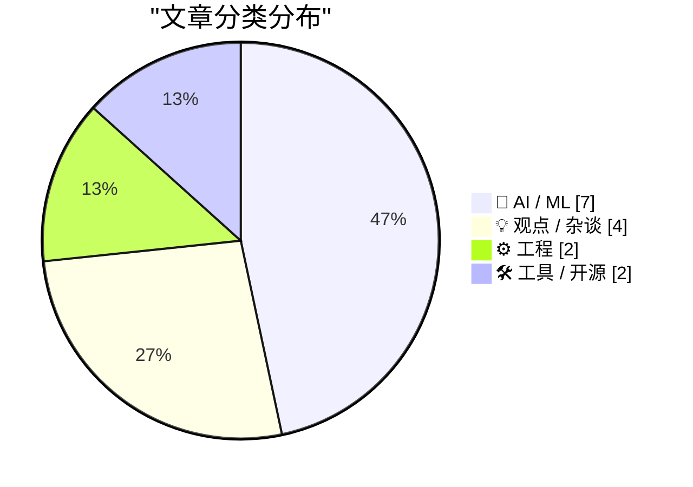
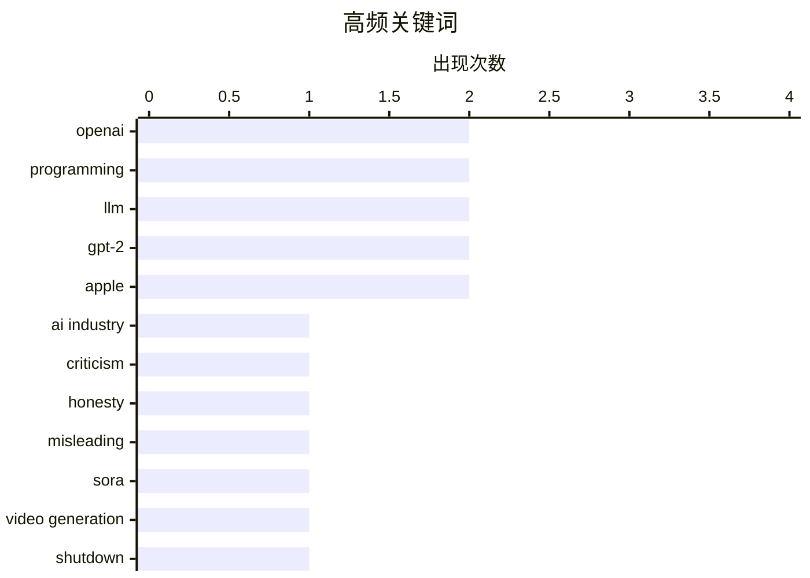

# 📰 AI 博客每日精选 — 2026-03-25

> 来自 Karpathy 推荐的 92 个顶级技术博客，AI 精选 Top 15

## 📝 今日看点

AI 行业持续震荡：OpenAI 宣布关闭 Sora 应用，但与此同时传出其正规划桌面端“超级应用”；Anthropic 则为 Claude 赋予计算机控制能力，引发关于 AI 助手深度介入用户系统的讨论。技术实践方面，从零构建 LLM 的教程热度不减，本周聚焦权重衰减与权重绑定等底层优化方案。工程理念上，“选择无聊技术”再被讨论，反映出业界对技术选型趋于保守的反思。

---

## 🏆 今日必读

🥇 **The AI Industry Is Lying To You**

[The AI Industry Is Lying To You](https://www.wheresyoured.at/the-ai-industry-is-lying-to-you/) — wheresyoured.at · 11 小时前 · 💡 观点 / 杂谈

> Hi! If you like this piece and want to support my independent reporting and analysis, why not subscribe to my premium newsletter? It&#x2019;s $70 a year, or $7 a month, and in return you get a weekly 

🏷️ AI industry, criticism, honesty, misleading

🥈 **OpenAI Is Closing Sora**

[OpenAI Is Closing Sora](https://x.com/soraofficialapp/status/2036546752535470382) — daringfireball.net · 3 小时前 · 🤖 AI / ML

> Sora, on Twitter/X:


  We’re saying goodbye to the Sora app. To everyone who created with
Sora, shared it, and built community around it: thank you. What
you made with Sora mattered, and we know this

🏷️ Sora, OpenAI, video generation, shutdown

🥉 **Claude 现在可以控制你的 Mac**

[Claude Can Now Take Control of Your Mac](https://claude.com/blog/dispatch-and-computer-use) — daringfireball.net · 3 小时前 · 🤖 AI / ML

> Anthropic 发布了 Claude 的计算机使用能力，允许 Claude 在 Claude Code 和 Claude Cowork 中控制用户电脑完成任务。当 Claude 缺乏所需工具时，它可以通过点击和导航屏幕来执行任务，包括自动打开文件、使用浏览器和运行开发工具。该功能目前面向 Claude Pro 和 Max 订阅用户开放研究预览版，特别适合与 Dispatch 集成使用，可让用户将任务分配给 Claude 完成。

💡 **为什么值得读**: 面向 AI 开发者和研究人员，了解 Claude 的新型人机协作方式。该功能代表了 AI 助手从单纯对话向实际任务执行的转变，是当前 agentic AI 发展的重要案例。

🏷️ Claude, AI agent, macOS, computer use

---

## 📊 数据概览

| 扫描源 | 抓取文章 | 时间范围 | 精选 |
|:---:|:---:|:---:|:---:|
| 88/92 | 2502 篇 → 46 篇 | 48h | **15 篇** |

### 分类分布



### 高频关键词



<details>
<summary>📈 纯文本关键词图（终端友好）</summary>

```
openai      │ ████████████████████ 2
programming │ ████████████████████ 2
llm         │ ████████████████████ 2
gpt-2       │ ████████████████████ 2
apple       │ ████████████████████ 2
ai industry │ ██████████░░░░░░░░░░ 1
criticism   │ ██████████░░░░░░░░░░ 1
honesty     │ ██████████░░░░░░░░░░ 1
misleading  │ ██████████░░░░░░░░░░ 1
sora        │ ██████████░░░░░░░░░░ 1
```

</details>

### 🏷️ 话题标签

**openai**(2) · **programming**(2) · **llm**(2) · gpt-2(2) · apple(2) · ai industry(1) · criticism(1) · honesty(1) · misleading(1) · sora(1) · video generation(1) · shutdown(1) · claude(1) · ai agent(1) · macos(1) · computer use(1) · superapp(1) · chatgpt(1) · desktop(1) · iteration(1)

---

## 🤖 AI / ML

### 1. OpenAI Is Closing Sora

[OpenAI Is Closing Sora](https://x.com/soraofficialapp/status/2036546752535470382) — **daringfireball.net** · 3 小时前 · ⭐ 25/30

> Sora, on Twitter/X:


  We’re saying goodbye to the Sora app. To everyone who created with
Sora, shared it, and built community around it: thank you. What
you made with Sora mattered, and we know this

🏷️ Sora, OpenAI, video generation, shutdown

---

### 2. Claude 现在可以控制你的 Mac

[Claude Can Now Take Control of Your Mac](https://claude.com/blog/dispatch-and-computer-use) — **daringfireball.net** · 3 小时前 · ⭐ 24/30

> Anthropic 发布了 Claude 的计算机使用能力，允许 Claude 在 Claude Code 和 Claude Cowork 中控制用户电脑完成任务。当 Claude 缺乏所需工具时，它可以通过点击和导航屏幕来执行任务，包括自动打开文件、使用浏览器和运行开发工具。该功能目前面向 Claude Pro 和 Max 订阅用户开放研究预览版，特别适合与 Dispatch 集成使用，可让用户将任务分配给 Claude 完成。

🏷️ Claude, AI agent, macOS, computer use

---

### 3. WSJ: ‘OpenAI Plans Launch of Desktop “Superapp”’

[WSJ: ‘OpenAI Plans Launch of Desktop “Superapp”’](https://www.wsj.com/tech/openai-plans-launch-of-desktop-superapp-to-refocus-simplify-user-experience-9e19931d?st=25wiu1) — **daringfireball.net** · 3 小时前 · ⭐ 24/30

> Berber Jin, reporting last week for The Wall Street Journal (gift link):


  OpenAI is planning to unify its ChatGPT app, coding platform Codex
and browser into a desktop “superapp,” a step to simplif

🏷️ OpenAI, superapp, ChatGPT, desktop

---

### 4. 从零编写 LLM（三十）—— 干预措施：权重衰减

[Writing an LLM from scratch, part 32f -- Interventions: weight decay](https://www.gilesthomas.com/2026/03/llm-from-scratch-32f-interventions-weight-decay) — **gilesthomas.com** · 1 天前 · ⭐ 23/30

> 作者基于 Sebastian Raschka 的《Build a Large Language Model (from Scratch)》一书，从零训练 GPT-2 small 模型，持续优化测试损失。在训练代码中展示了如何创建优化器的具体实现，包括权重衰减（weight decay）策略的配置。文章记录了从零构建 LLM 的完整实践过程，包含详细的代码示例和调参经验。

🏷️ LLM, GPT-2, weight decay, neural network

---

### 5. 从零编写 LLM（三十一）—— 干预措施：权重绑定

[Writing an LLM from scratch, part 32g -- Interventions: weight tying](https://www.gilesthomas.com/2026/03/llm-from-scratch-32g-interventions-weight-tying) — **gilesthomas.com** · 8 小时前 · ⭐ 23/30

> 作者讨论了 LLM 中的权重绑定（weight tying）技术，虽然该技术可以减少模型参数量，但在实践中会导致模型性能下降，因此现代 LLM 实际上很少使用。作者解释了权重绑定导致性能恶化的直观原因，并计划在后续文章中进一步验证这一观点。

🏷️ LLM, GPT-2, weight tying, transformer

---

### 6. Weekly Update 496

[Weekly Update 496](https://www.troyhunt.com/weekly-update-496/) — **troyhunt.com** · 1 天前 · ⭐ 23/30

> Watching OpenClaw do its thing must be like watching the first plane take flight. It&apos;s a bit rickety and stuck together with a lot of sticky tape, but squint and you can see the potential for age

🏷️ OpenClaw, agentic AI, automation, AI agents

---

### 7. Pebble Time 2已进入量产阶段！

[Pebble Time 2 Is In Mass Production!](https://repebble.com/blog/pebble-time-2-is-in-mass-production) — **ericmigi.com** · 1 天前 · ⭐ 21/30

> Pebble Time 2智能手表已正式进入大规模生产阶段。相较于前代产品，PT2带来了重要的防水性能升级，支持30米防水深度。此外，文章还提及了关于Pebble Time 2的地址确认邮件相关事项。这是Peble粉丝期待已久的二代产品量产的重要里程碑，标志着这款以E-ink屏幕和超长续航著称的智能手表即将正式上市开售。

🏷️ AI, programming, job replacement

---

## 💡 观点 / 杂谈

### 8. The AI Industry Is Lying To You

[The AI Industry Is Lying To You](https://www.wheresyoured.at/the-ai-industry-is-lying-to-you/) — **wheresyoured.at** · 11 小时前 · ⭐ 26/30

> Hi! If you like this piece and want to support my independent reporting and analysis, why not subscribe to my premium newsletter? It&#x2019;s $70 a year, or $7 a month, and in return you get a weekly 

🏷️ AI industry, criticism, honesty, misleading

---

### 9. Code as a Tool of Process

[Code as a Tool of Process](https://blog.jim-nielsen.com/2026/code-as-process/) — **blog.jim-nielsen.com** · 9 小时前 · ⭐ 24/30

> <p><a href="https://stevekrouse.com/precision" >Steve Krouse wrote a piece</a> that has me nodding along:</p>
<blockquote>
<p>Programming, like writing, is an activity, where one iteratively sharpens 

🏷️ programming, iteration, process, code as tool

---

### 10. 古德哈特法则与"预测市场"

[Pluralistic: Goodhart's Law vs "prediction markets" (24 Mar 2026)](https://pluralistic.net/2026/03/24/degenerated-gambling/) — **pluralistic.net** · 17 小时前 · ⭐ 20/30

> 本文讨论了古德哈特法则（Goodhart's Law）与所谓"预测市场"之间的关系，探讨了"把枪口对准指标"（Putting a gun to the metric's head）的危害。文章链接还涉及多个话题：苹果与互操作性的法律诉讼、雅虎相关争议、苹果与专利 trolls 的对抗、《阿甘正传》开场和弦、Mondrian Pong游戏、以及"IP"相关的专利 trolling 话题。作者还列出了即将在伯克利、蒙特利尔、伦敦、柏林等地的公开活动行程。

🏷️ Goodhart's Law, prediction markets, metrics

---

### 11. 人员不足作为逐利化的形式

[Pluralistic: Understaffing as a form of enshittification (23 Mar 2026)](https://pluralistic.net/2026/03/22/nobodys-home/) — **pluralistic.net** · 1 天前 · ⭐ 20/30

> 本文将人员不足（understaffing）定义为一种"逐利化"（enshittification）形式，认为这是将价值从工人、患者和购物者转移给投资者的一种方式。文章探讨了企业通过减少人员配置来提升短期利润、最大化股东价值的做法及其社会影响。同时链接还讨论了AI无法完成你的工作、充足时代的应对策略、法国与iTunes的争议、自由开源微处理器、以及计算机安全的民间模型等多个话题。

🏷️ understaffing, enshittification, workers

---

## ⚙️ 工程

### 12. 选择无聊技术，创新实践

[Choose Boring Technology and Innovative Practices](https://buttondown.com/hillelwayne/archive/choose-boring-technology-and-innovative-practices/) — **buttondown.com/hillelwayne** · 14 小时前 · ⭐ 23/30

> 文章讨论了著名的「选择无聊技术」理念，指出现代软件开发中使用创新技术面临两个核心问题：一是新技术存在太多「未知的未知」，而成熟技术的缺陷已被充分了解；二是新技术在人们失去新鲜感后仍会长期带来维护负担。作者建议在技术选型上保持保守，在工程实践和方法论上持续创新。

🏷️ technology selection, innovation, software engineering

---

### 13. WWDC 2026将于6月8日至12日举行

[WWDC 2026: June 8–12](https://www.apple.com/newsroom/2026/03/apples-worldwide-developers-conference-returns-the-week-of-june-8/) — **daringfireball.net** · 1 天前 · ⭐ 21/30

> 苹果全球开发者大会（WWDC 2026）正式宣布将于6月8日至12日举办。大会以周一的主题演讲（Keynote）和平台状态联盟（Platforms State of the Union）拉开帷幕。整个会议周将通过线上形式进行，提供超过100个视频 sessions 和互动小组实验活动。开发者可以直接与苹果工程师和设计师连接，深入探索最新发布的重大公告。会议将在Apple Developer应用、官网、YouTube频道以及中国的哔哩哔哩Apple Developer频道同步播出。这是苹果面向全球开发者展示最新技术平台和开发工具的重要年度盛会。

🏷️ WWDC, Apple, developers, conference

---

## 🛠 工具 / 开源

### 14. iOS 26.4

[iOS 26.4](https://www.macrumors.com/guide/ios-26-4-features/) — **daringfireball.net** · 4 小时前 · ⭐ 21/30

> Good rundown of everything new and changed, as usual, from Juli Clover at MacRumors. This has been a noticeable change for me:


  The App Store merges apps and purchase history, and has a
dedicated s

🏷️ iOS, Apple, App Store, software update

---

### 15. Wander 0.2.0发布：去中心化自托管网页控制台

[Wander 0.2.0](https://susam.net/code/news/wander/0.2.0.html) — **susam.net** · 1 天前 · ⭐ 21/30

> Wander 0.2.0是该软件的第二个正式版本，这是一款小型去中心化自托管网页控制台。该项目允许网站访问者探索由独立个人网站所有者社区推荐的优质网站和页面。0.1.0版本是作者为自己网站开发的初始版本，最初只有作者一个用户。作者在0.2.0版本中进行了多项改进，但文章内容在此处截断，具体更新细节未完整呈现。

🏷️ Wander, self-hosted, web console, open source

---

*生成于 2026-03-25 04:46 | 扫描 88 源 → 获取 2502 篇 → 精选 15 篇*
*基于 [Hacker News Popularity Contest 2025](https://refactoringenglish.com/tools/hn-popularity/) RSS 源列表，由 [Andrej Karpathy](https://x.com/karpathy) 推荐*
*由「懂点儿AI」制作，欢迎关注同名微信公众号获取更多 AI 实用技巧 💡*
