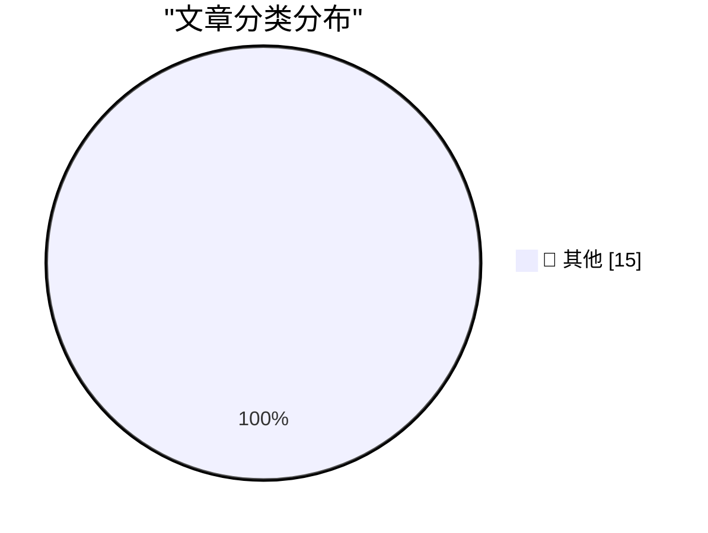

# 📰 AI 博客每日精选 — 2026-03-27

> 来自 Karpathy 推荐的 92 个顶级技术博客，AI 精选 Top 15

## 🏆 今日必读

🥇 **We Rewrote JSONata with AI in a Day, Saved $500K/Year**

[We Rewrote JSONata with AI in a Day, Saved $500K/Year](https://simonwillison.net/2026/Mar/27/vine-porting-jsonata/#atom-everything) — simonwillison.net · 3 小时前 · 📝 其他

> We Rewrote JSONata with AI in a Day, Saved $500K/Year

🥈 **My minute-by-minute response to the LiteLLM malware attack**

[My minute-by-minute response to the LiteLLM malware attack](https://simonwillison.net/2026/Mar/26/response-to-the-litellm-malware-attack/#atom-everything) — simonwillison.net · 4 小时前 · 📝 其他

> My minute-by-minute response to the LiteLLM malware attack

🥉 **Quantization from the ground up**

[Quantization from the ground up](https://simonwillison.net/2026/Mar/26/quantization-from-the-ground-up/#atom-everything) — simonwillison.net · 11 小时前 · 📝 其他

> Quantization from the ground up

---

## 📊 数据概览

| 扫描源 | 抓取文章 | 时间范围 | 精选 |
|:---:|:---:|:---:|:---:|
| 88/92 | 2503 篇 → 37 篇 | 48h | **15 篇** |

### 分类分布

---

## 📝 其他

### 1. We Rewrote JSONata with AI in a Day, Saved $500K/Year

[We Rewrote JSONata with AI in a Day, Saved $500K/Year](https://simonwillison.net/2026/Mar/27/vine-porting-jsonata/#atom-everything) — **simonwillison.net** · 3 小时前 · ⭐ 15/30

> We Rewrote JSONata with AI in a Day, Saved $500K/Year

---

### 2. My minute-by-minute response to the LiteLLM malware attack

[My minute-by-minute response to the LiteLLM malware attack](https://simonwillison.net/2026/Mar/26/response-to-the-litellm-malware-attack/#atom-everything) — **simonwillison.net** · 4 小时前 · ⭐ 15/30

> My minute-by-minute response to the LiteLLM malware attack

---

### 3. Quantization from the ground up

[Quantization from the ground up](https://simonwillison.net/2026/Mar/26/quantization-from-the-ground-up/#atom-everything) — **simonwillison.net** · 11 小时前 · ⭐ 15/30

> Quantization from the ground up

---

### 4. datasette-files-s3 0.1a1

[datasette-files-s3 0.1a1](https://simonwillison.net/2026/Mar/25/datasette-files-s3/#atom-everything) — **simonwillison.net** · 1 天前 · ⭐ 15/30

> datasette-files-s3 0.1a1

---

### 5. Thoughts on slowing the fuck down

[Thoughts on slowing the fuck down](https://simonwillison.net/2026/Mar/25/thoughts-on-slowing-the-fuck-down/#atom-everything) — **simonwillison.net** · 1 天前 · ⭐ 15/30

> Thoughts on slowing the fuck down

---

### 6. datasette-llm 0.1a1

[datasette-llm 0.1a1](https://simonwillison.net/2026/Mar/25/datasette-llm/#atom-everything) — **simonwillison.net** · 1 天前 · ⭐ 15/30

> datasette-llm 0.1a1

---

### 7. LiteLLM Hack: Were You One of the 47,000?

[LiteLLM Hack: Were You One of the 47,000?](https://simonwillison.net/2026/Mar/25/litellm-hack/#atom-everything) — **simonwillison.net** · 1 天前 · ⭐ 15/30

> LiteLLM Hack: Were You One of the 47,000?

---

### 8. Engineers do get promoted for writing simple code

[Engineers do get promoted for writing simple code](https://seangoedecke.com/simple-work-gets-rewarded/) — **seangoedecke.com** · 1 天前 · ⭐ 15/30

> Engineers do get promoted for writing simple code

---

### 9. Apple Discontinues the Mac Pro With No Plans to Bring It Back

[Apple Discontinues the Mac Pro With No Plans to Bring It Back](https://9to5mac.com/2026/03/26/apple-discontinues-the-mac-pro/) — **daringfireball.net** · 3 小时前 · ⭐ 15/30

> Apple Discontinues the Mac Pro With No Plans to Bring It Back

---

### 10. The Apple Charging Situation

[The Apple Charging Situation](https://randsinrepose.com/guides/apple-charging-guide.html) — **daringfireball.net** · 7 小时前 · ⭐ 15/30

> The Apple Charging Situation

---

### 11. You Can Jump Right to the Updates Screen in the App Store App on iOS 26.4

[You Can Jump Right to the Updates Screen in the App Store App on iOS 26.4](https://daringfireball.net/linked/2026/03/24/ios-264) — **daringfireball.net** · 8 小时前 · ⭐ 15/30

> You Can Jump Right to the Updates Screen in the App Store App on iOS 26.4

---

### 12. Disney Drops Vaporware $1B Investment in OpenAI After Sora Got Axed

[Disney Drops Vaporware $1B Investment in OpenAI After Sora Got Axed](https://variety.com/2026/digital/news/openai-shutting-down-sora-video-disney-1236698277/) — **daringfireball.net** · 8 小时前 · ⭐ 15/30

> Disney Drops Vaporware $1B Investment in OpenAI After Sora Got Axed

---

### 13. Google Brags About Android Web Browser Benchmark Scores on Unnamed Devices; Gullible Reporters Fall for It

[Google Brags About Android Web Browser Benchmark Scores on Unnamed Devices; Gullible Reporters Fall for It](https://blog.chromium.org/2026/03/android-sets-new-record-for-mobile-web.html) — **daringfireball.net** · 8 小时前 · ⭐ 15/30

> Google Brags About Android Web Browser Benchmark Scores on Unnamed Devices; Gullible Reporters Fall for It

---

### 14. NYT: ‘Melania Trump Appears With a Robot, Saying More Children Should Be Educated by Them’

[NYT: ‘Melania Trump Appears With a Robot, Saying More Children Should Be Educated by Them’](https://www.nytimes.com/2026/03/25/us/politics/melania-trump-robot.html?smid=nytcore-ios-share) — **daringfireball.net** · 9 小时前 · ⭐ 15/30

> NYT: ‘Melania Trump Appears With a Robot, Saying More Children Should Be Educated by Them’

---

### 15. The Information: ‘Apple Can “Distill” Google’s Big Gemini Model’

[The Information: ‘Apple Can “Distill” Google’s Big Gemini Model’](https://www.theinformation.com/newsletters/ai-agenda/apple-can-distill-googles-big-gemini-model?rc=jfy0lk) — **daringfireball.net** · 10 小时前 · ⭐ 15/30

> The Information: ‘Apple Can “Distill” Google’s Big Gemini Model’

---

*生成于 2026-03-27 04:04 | 扫描 88 源 → 获取 2503 篇 → 精选 15 篇*
*基于 [Hacker News Popularity Contest 2025](https://refactoringenglish.com/tools/hn-popularity/) RSS 源列表，由 [Andrej Karpathy](https://x.com/karpathy) 推荐*
*由「懂点儿AI」制作，欢迎关注同名微信公众号获取更多 AI 实用技巧 💡*
